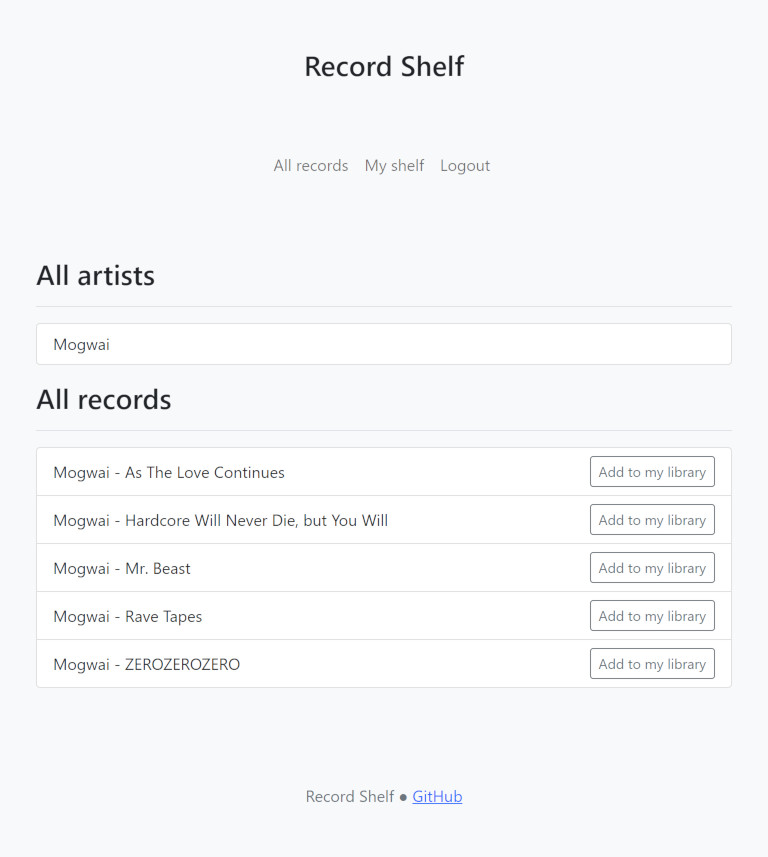

# Record Shelf



Simple introduction to Django and Bootstrap. This website allows many users to manage and compare their music collections.

## Development

### Repository structure

You can think of `recordshelf/` as the website and `records/` as the application that makes it tick.

#### `records/`: Django app

This folder contains the main application logic. It's structured in the Django [Model-View-Controller](https://en.wikipedia.org/wiki/Model%E2%80%93view%E2%80%93controller) pattern. The initial app was generated with `./manage.py startapp`. Then the app was added to `INSTALLED_APPS`.

#### `recordshelf/`: Django project

Django project related files, useful when deploying the server in various environments. These files were generated as a part of the project by `django-admin`.

#### `manage.py`: Django CLI

Django command line utility. Very useful. This file was generated as a part of the project by `django-admin`.

### Install Django

You'll need a recent version of Python 3 installed. Install Django:

```sh
python -m pip install django
```

And then verify that the installation was successfull:

```sh
python -m django --version
```

### Initial migration

Initialize the local file-backed sqlite-database, this means you don't have to spin up MariaDB or another database for development.

```sh
python ./manage.py migrate
```

This creates a local file `./db.sqlite3`.

### Development server

```sh
python ./manage.py runserver
```

The development server is now listening to <http://localhost:8000>.

### Generate migrations

Migrations will be generated based on your changes to `../models.py`. Please note that the code in `../migrations/` is managed by this command, and you don't necessarily have to understand it.

```sh
python ./manage.py makemigrations
```

You'll need to also migrate the changes to your development server.

```sh
python ./manage.py migrate
```

## License

Distributed under the MIT License.
